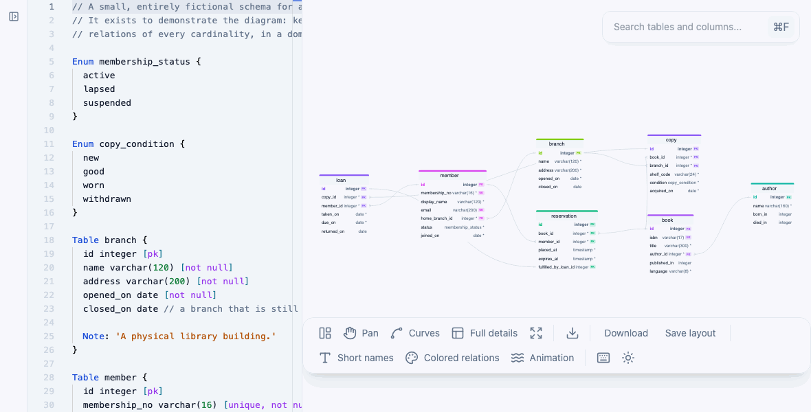

# Database schema visualizer

A VS Code extension to visualize database schemas as ERD diagrams from DBML or Prisma files.

> **Fork notice.** This repository is a fork of [BOCOVO/db-schema-visualizer](https://github.com/BOCOVO/db-schema-visualizer), maintained independently under the [MIT License](./LICENSE). The original project and its authors are credited below; modifications in this fork are maintained by [AKonyshev](https://github.com/AKonyshev).

## Demo



## Features

- Create entity-relationship diagrams from DBML or Prisma code
- Light and dark themes
- DBML extension: MetaInfo layout persistence, SVG/AsciiDoc export, per-table relation visibility, Alt+H ref toggling
- Colored and animated relations, plus keyboard shortcuts for the view actions with a built-in legend (`?`)
- **Fork additions (DBML):** import a PostgreSQL schema to DBML, compare an open `.dbml` file with a live database

## Install

### Marketplace (this fork)

- [DBML extension](https://marketplace.visualstudio.com/items?itemName=konyshevav.dbml-schema-visualizer)
- [Prisma extension](https://marketplace.visualstudio.com/items?itemName=konyshevav.prisma-erd-visualizer)

### Upstream (original author)

- [bocovo.dbml-erd-visualizer](https://marketplace.visualstudio.com/items?itemName=bocovo.dbml-erd-visualizer)
- [bocovo.prisma-erd-visualizer](https://marketplace.visualstudio.com/items?itemName=bocovo.prisma-erd-visualizer)

### From source

```bash
git clone https://github.com/AKonyshev/db-schema-visualizer.git
cd db-schema-visualizer
yarn install
```

Open the repo in VS Code or Cursor, then **Run and Debug → Debug DBML Extension** (`F5`). See [packages/dbml-vs-code-extension/TESTING.md](./packages/dbml-vs-code-extension/TESTING.md) for manual test steps.

## Extension packages

- [DBML extension](./packages/dbml-vs-code-extension/README.md)
- [Prisma extension](./packages/prisma-vs-code-extension/README.md)

## Attribution & license

This software is licensed under the [MIT License](./LICENSE). Per the license, the copyright notice and permission notice are included in distributions of this project.

|                     |                                                                                                                                                |
| ------------------- | ---------------------------------------------------------------------------------------------------------------------------------------------- |
| **Upstream**        | [BOCOVO/db-schema-visualizer](https://github.com/BOCOVO/db-schema-visualizer) — original ERD visualizer for DBML and Prisma                    |
| **Original author** | [@BOCOVO](https://github.com/BOCOVO)                                                                                                           |
| **This fork**       | [AKonyshev/db-schema-visualizer](https://github.com/AKonyshev/db-schema-visualizer) — maintained by [@AKonyshev](https://github.com/AKonyshev) |

Upstream tutorials (still useful for core diagram features):

- [Preview DBML from VS Code](https://juste.bocovo.me/preview-dbml-code-from-vscode)
- [Prisma ERD in VS Code](https://juste.bocovo.me/visualize-the-entity-relationship-diagram-from-prisma-code-in-the-vscode-editor)

## Contribute

See [CODE_OF_CONDUCT.md](./CODE_OF_CONDUCT.md). For upstream changes, consider contributing to [BOCOVO/db-schema-visualizer](https://github.com/BOCOVO/db-schema-visualizer) first when the change is not fork-specific.
